# Git

###  一、安装

#### 1.[Git官网](https://git-scm.com/)

````text
//直接安装软件即可
````

#### 2.配置用户名和密码

````c#
git config  --global user.name "your_name"
git config --global user.eamil your_email@domain.com
git config --list //查看所有配置
````

#### 3.工作原理 / 流程：


>Workspace：工作区
>        Index / Stage：暂存区
>        Repository：仓库区（或本地仓库)
>        Remote：远程仓库

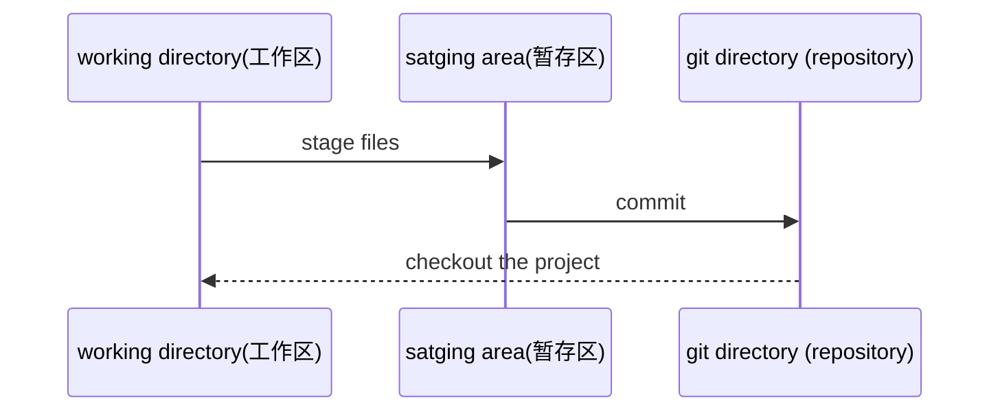

>状态：
>
>已提交
>
>已修改
>
>已暂存

#### 4.创建版本库并提交文件

##### 4.1初始化Git本地仓库

>`git init`  就会本地初始化一个本地仓库，
>
>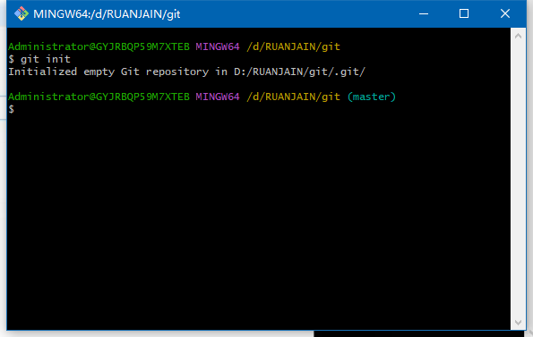

##### 4.2.新建文本git001.txt

>执行 `git add` 添加文件到暂存区,在git同级目录下添加该文件后，可以使用  `git status`查看工作目录和暂存区文件状态
>
>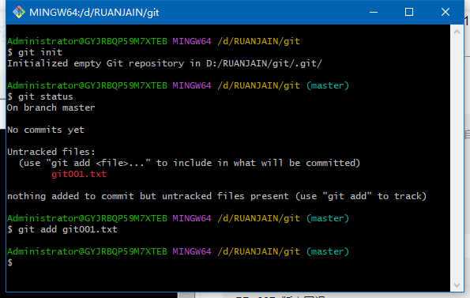
>
>已经将git001.txt添加到暂存区，但是并没有提交
>
>查看状态
>
>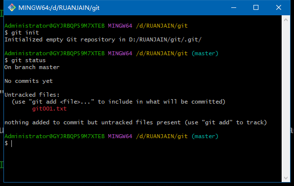

##### 4.3、文件提交到本地版本库中

>文件被添加到暂存区后，执行 `git commit`命令提交暂存区的文件到本地版本库中
>
>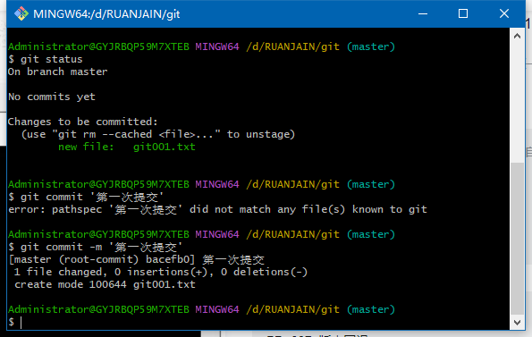
>
>代码：git commit -m  "文件说明"

##### 4.4、查看提交信息

>git log
>
>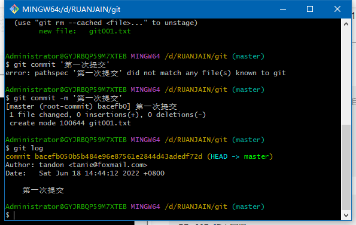
>
><u>注意：当使用git的时候，不小心进入了编辑模式，出现end，可以使用:q可以退出。</u>
>
>一行显示提交日志
>
>`git --pretty=oneline`
>
>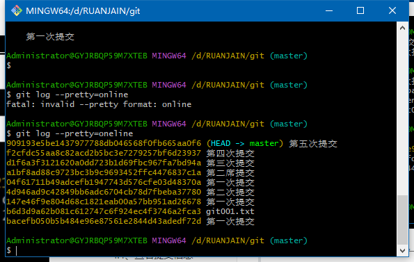
>
>

##### 4.5、文件修改与提交

>修改文件git001.text   
>
>此时查看文件 git status
>
>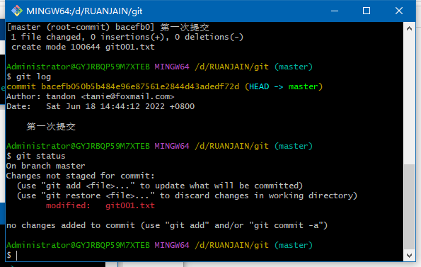
>
>提交当前目录的所有文件 `git add .`
>
>当git commit 后面的不添加说明，系统强制进入说明环境 ： 先输入i/a进入编辑模式，输入说明"第二次修改"，按esc  再输入 :wq，即可。
>
>>git 本地库和工作区文件区别查看：
>>
>>`git diff HEAD --- git01.txt`
>>
>>git 直接提交修改文件 git commit -am '说明'  

##### 4.6、暂存区（stage）撤销文件

>1.`git restore -- staged git002.txt`  
>
>2.`git resset HEAD git002.txt`
>
>区别：1.能够将在暂存区文件可选的移出文件 2.取消上一次的操作

##### 4.7.版本回退

>`git reset --hard HEAD^` 回退一个版本
>
>指定回到某个版本 ：`git reset --hard HEAD~12`
>
>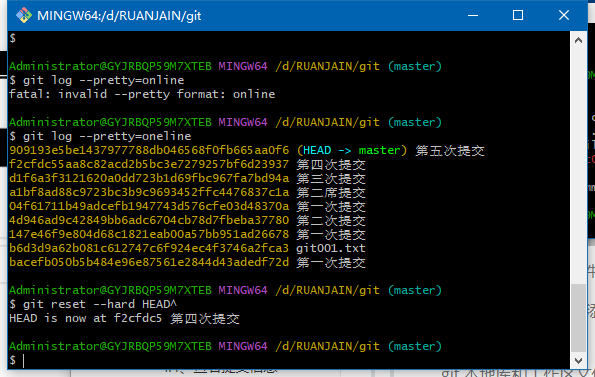
>
>回退到某个版本，还可以 `git reset --hard  f2cfdc55aa8c82acd2b5b` 一般取版本的前8位，表示唯一即可。
>
>注意：复制 ctrl+insert  粘贴：shift + insert  清屏：clear
>
>所以版本也可以前进
>
>查看所有日志 `git reflog`
>
>查看当前目录文件 `git ls-files`

##### 4.8、文件删除

>拉取文件最新版本 ：`git checkout git002.txt`
>
>删除：
>
>> 方法1： git add git002.txt  然后提交 git commit -m '删除git002.txt '
>>
>> 方法2：git rm git002.txt

### 二、远程仓库 gitHub

##### 1.我的github账号：

3398772130@qq.com

密码：hl2587910

账号名：LULU-001

##### 2.不登录状态下载仓库内容

> 网页直接点击downLoad ZIP下载
>
> git下载：
>
> 复制仓库地址 ：https://github.com/bailicangdu/vue2-elm.git
>
> `git clone https://github.com/bailicangdu/vue2-elm.git`

##### 3.SSH下载项目

````text
/*优势：
安全性高
速度快*/
先生成keys,需要登陆账号
ssh-keygen -t rsa -C "3398772130@qq.com"  回车
git@github.com:bailicangdu/vue2-elm.git
git clone git@github.com:bailicangdu/vue2-elm.git
````

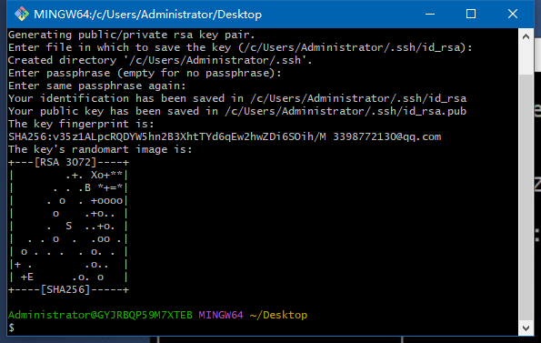

>检测是否关联：ssh -T git@github.com
>
>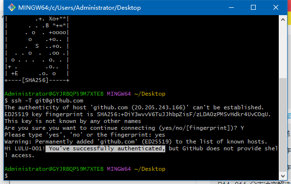

>克隆线上文件
>
>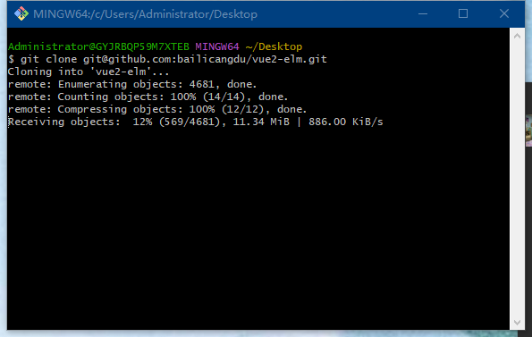
>
>下载完成
>
>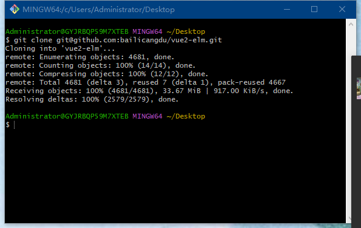

##### 4、远程仓库推送

>将自己的项目推送到远程仓库(主干项目)
>
>1.新建仓库 Create a new repository
>
>2.ssh方式上传
>
>>```
>>echo "# git01" >> README.md
>>git init
>>git add README.md
>>git commit -m "first commit"
>>git branch -M main
>>git remote add origin git@github.com:LULU-001/git01.git
>>git push -u origin main
>>```
>
>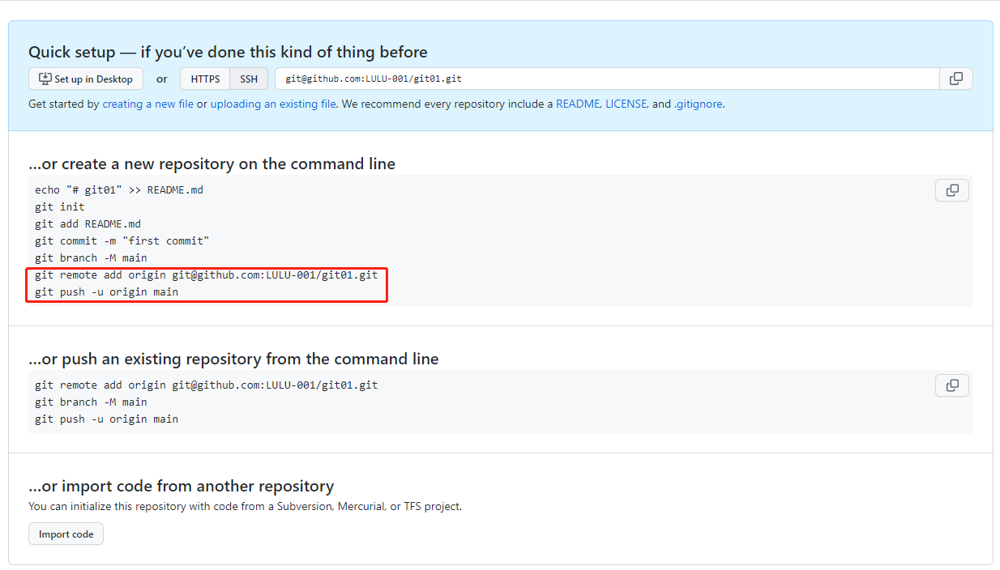
>
>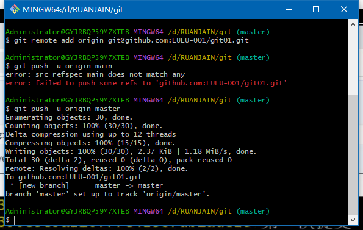
>
>>再次本地修改文件推送远程仓库
>>
>>`git  add 'git001.txt'`
>>
>>`git commit -m "推送到仓库"`
>>
>>`git push `
>>
>>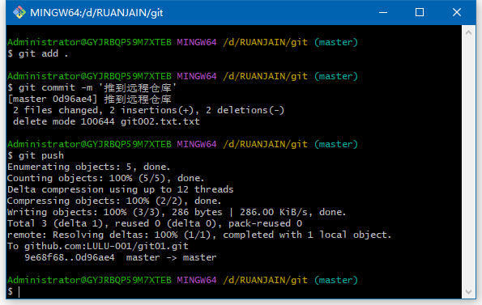

##### 5、Git分支操作（本地）

| 命令                                     | 描述                                                         |
| ---------------------------------------- | ------------------------------------------------------------ |
| git checkout -b new_branch               | 新建分支并切换到新建分支                                     |
| git checkout branch                      | 切换到指定分支                                               |
| git branch -d new_branch                 | 删除指定分支                                                 |
| git merge branch                         | 合并分支                                                     |
| git branch                               | 查看所有分支，并且*号标记当前所在分支                        |
| git checkout -m \|-M oldbranch newbranch | 重命名分支，如果newbranch名字分支已存在，则需要使用-M强制命名，否则，使用-m进行重命名 |

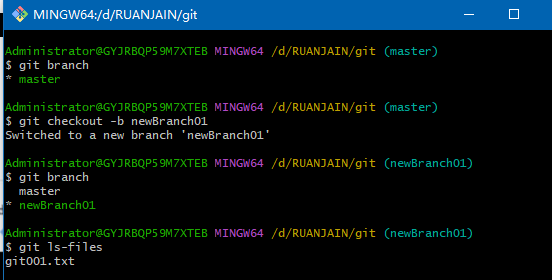

>注意：新建分支内容即为主干内容，分支操作所有内容不会影响主干操作，合并分支需要切回主干。

##### 6.远程分支操作

6.1分支`push`和`pull`操作

| 命令                                              | 描述                             |
| ------------------------------------------------- | -------------------------------- |
| git branch -a                                     | 查看本地与远程分支               |
| git push origin branch_name                       | 推动本地分支到远程               |
| git push origin :remote_branch                    | 删除远程分支（本地分支还在保留） |
| git checkout -b local_branch origin/remote_branch | 拉取远程指定分支并在本地创建分支 |
|                                                   |                                  |

>注意：不能在当前分支删除当前分支
>
>##### 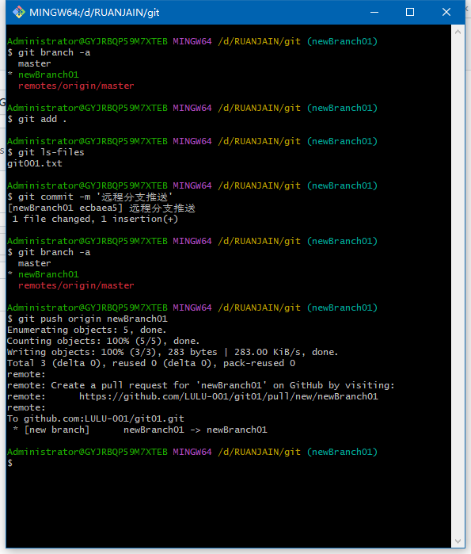
>
>> 获取远程仓库最新状态：git fetch
>
>>获取远程分支并拉取远程分支内容到本地
>>
>>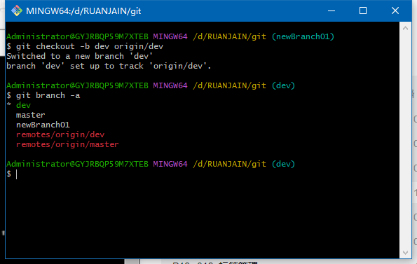

##### 7.分支冲突解决(本地)

>> 冲突演示：
>
>.jpg)
>
>git001.txt
>
>.jpg)
>
>> 图表式查看日志：`git log --graph --pretty=oneline`


##### 8.多人协同操作冲突

>先拉取分支内容：git pull
>
>后解决

##### 9.标签管理

| 命令                                | 描述                           |
| ----------------------------------- | ------------------------------ |
| git tag tag_name                    | 新建标签默认为HEAD             |
| git tag -a tag_name -m "xxxx"       | 添加标签并指定标签描述信息     |
| git tag                             | 查看本地所有标签               |
| git tag -d tag_name                 | 删除一个本地标签               |
| git push origin tag_name            | 推送本地标签到远程             |
| git push origin --tags              | 推送全部未推送的本地标签到远程 |
| git push origin :refs/tags/tag_name | 删除一个远程标签               |

>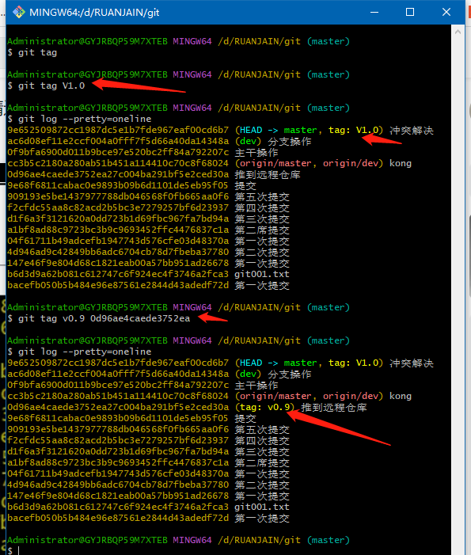
>
>

