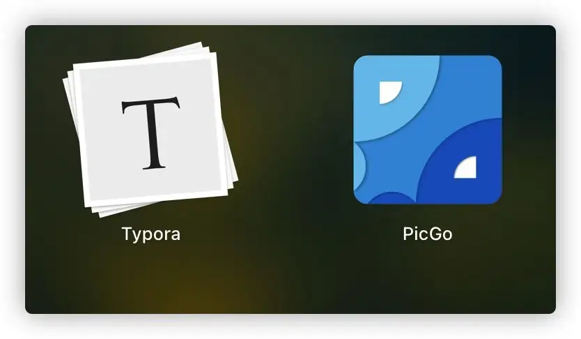

# markdown

>他是一种轻量的标记语言
>
>hyper text markup language(html)超文本标记语言
>
>

###  二、标题

1.Markdown的标题

>语法：# +space   ## + space  ### +space  ......

> 快捷键 ctrl +1...5
>
> ctrl + 加号、减号

### 三、段落

直接进行文字编写

1.字体

>1.粗体  一对双星号包裹  ctrl+b
>
>2.删除线 一对双飘号包裹  alt+shift +5
>
>3.下划线 一对u标签包裹  ctrl +u
>
>4.斜体 用一对单星号包裹 ctrl +I

> 代码：（```text）
>
> ```
> **这是粗体**
> ~~这公司删除线~~
> <u>这是下划线</u>
> *这是斜体*
> ```
>
> 

>效果：
>
>**这是粗体**
>
>~~删除线~~
>
><u>下划线</u>
>
>*斜体*

2.分割线

>语法：
>
>分割线：三个减号回车

> 代码：
>
> ```text
> ---回车
> ```

>效果
>
>---
>
>

3.脚注

>说明：对文本进行补充说明
>
>

>代码：
>
>````text
>[^键入文本]
>[^Spring boot]
>[^Spring boot] : 这是一个好用框架
>````

>效果：
>
>这是一个技术 [^Spring boot]
>
>[^Spring boot]:    这是一个非常好用的框架

### 四、列表

1.无序列表

>代码：
>
>````text
>*空格
>````

>效果：
>
>1.只有同一级别
>
>* 苹果
>* 香蕉
>* 橘子
>
>2.子级别
>
>* 一级分类
>  * 二级分类
>  * 二级分类

2.有序列表

> 代码：
>
> ````text
> 1.空格
> ````
>
> 

>效果：
>
>1. 这是第一个标题
>2. 这是第二个标题
>3. 这是第三个标题
>   * 这是子内容
>4. 这是第四个标题

### 五、区块显示

> 代码:
>
> ````text
> >回车
> ````
>
> 

>效果：
>
>>这是最外层  
>>
>>>
>>>
>>>里层
>
>

### 六、代码块显示

> 代码：
>
> ````text
> ````js/java/text/c#
> ````js XXXXX
> ````
>
> 

>效果：
>
>````js
>function text(){
>    alert('hello')
>}
>````
>
>````c#
>public class Text(){
>    public static void main(string[] args){
>        console.writen('hello world')
>    }
>}
>````
>
>

### 七、链接

>代码：
>
>````text
>www.baidu.com 
>[百度一下] (https://www.baicu.com)
>````
>
>
>
>

> 效果：
>
> www.baidu.com
>
> [百度一下](https://www.baidu.com)

### 八、图片插入

>代码：
>
>````text
>
>````
>
>

> 效果：
>
> 


### 九、表格效果

> 代码：(ctrl +T)
>
> ````text
> |表头|表头|表头|
> |----|----|----|
> |1|2|3|
> ````

> 效果：
>
> | 1    | 2    | 3    |
> | ---- | ---- | ---- |
> |      |      |      |
>
> |      |      |      |
> | ---- | ---- | ---- |
> | 1    |      |      |
> | 2    |      |      |
> | 3    |      |      |
>
> 

### 十、其他

> 代码：
>
> ````text
> <kbd></kbd>  ``
> ````
>
> 

> 效果：
>
> <kbd>ctrl</kbd>
>
> `ctrl`

# 画图

初始化空白图

>代码：
>
>````text
>```mermaid
>````
>
>

>效果：
>
>```mermaid
>```
>
>
>
>

1.流程图（rgaph）

>代码：
>
>````text
>graph TD;
>A-->B;
>A-->C;
>B-->D;
>````

>效果：
>
>```mermaid
>graph TD;
>A-->B;
>A-->C;
>B-->D;
>```
>
>
>
>
>
>

2.时序图（sequenceDiagram)

>代码：
>
>````tsx
>sequenceDiagram
>Alice->>john : hello John, how are you? 
>Jhon-->>Alice : Great!
>````
>
>说明：实线是一个横杠，虚线两个横杠

>```mermaid
>sequenceDiagram
>Alice->>john : hello John, how are you? 
>Jhon-->>Alice : Great!
>```
>
>
>
>

3.状态图（stateDiagram）

>代码：
>
>````text
>stateDiagram 
>[*]-->s1 
>s1-->[*]
>````

>```mermaid
>stateDiagram 
>[*]-->s1 
>s1-->[*]
>```
>
>
>
>

4.类图(classDiagram)

>代码：
>
>````text
>classDiagram
>Animal <|-- Duck
>Animal <|-- fish
>Animal <|-- zebra
>Animal : +int age
>Animal : +String gender
>Animal : +jsMammal()
>Animal : +mate()
>class Duck{
>    +String beakColor
>    +Swim()
>    +quack()
>}
>class fish{
>    -int sizeInFeet
>    -canEat()
>}
>class Zebra{
>    + boll is_wild
>    +run()
>}
>
>//  <|--表示继承 ，+表示public -表示private
>````
>
>效果：
>
>```mermaid
>classDiagram
>Animal <|-- Duck
>Animal <|-- fish
>Animal <|-- zebra
>Animal : +int age
>Animal : +String gender
>Animal : +jsMammal()
>Animal : +mate()
>class Duck{
>    +String beakColor
>    +Swim()
>    +quack()
>}
>class fish{
>    -int sizeInFeet
>    -canEat()
>}
>class zebra{
>    +boll is_wild
>    +run()
>}
>```
>
>

5.甘特图（gantt）--项目的计划排期

>代码：
>
>````text
>gantt
>
>title 工作计划
>dateformat YYYY--MM__DD
>section Section
>A task         :a1,2020-01-12,30d
>Another task   :after a1 ,20d
>section Another
>task in sec   :2020-01-12,12d
>another task  :24d
>````
>
>效果：
>
>```mermaid
>gantt
>
>title 工作计划
>dateformat YYYY-MM-DD
>section Section
>A task         :a1, 2020-01-12 , 30d
>Another task   :after a1 ,20d
>section Another
>task in sec   :2020-01-12,12d
>another task  :24d
>```
>
>
>
>

6.饼图（pie)

>代码：
>
>````text
>pie
>title key elements in product x
>"calcium" : 42.96
>"Potassium" : 50.05
>"Magnesium" : '10.01'
>"Iron" : 5
>````
>
>效果：
>
>```mermaid
>pie
>title key elements in Product x
>"calcium" : 42.96
>"Potassium" : 50.05
>"Magnesium" : 10.01
>"Iron" : 5
>```
>
>

7.图片导出

>选择菜单导出为图片或者网页格式
>
>