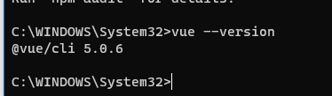

# vue项目

## 1.项目介绍

> 技术点
>
> 
>
> ```mermaid
> graph TD;
> 技术点-->vue;
> 技术点-->vue-cli;
> 技术点-->vuex;
> 技术点--> vueRouter;
> 技术点--> Axios;
> 技术点--> ES6;
> 技术点--> Webpack ;
> 技术点--> ElementUI ;
> 技术点--> webSocket[在线聊天];
> 技术点-->  font-awesome ;
> 技术点--> js_file-downLoad ;
> 技术点-->  vue-chat ;
> ```
>
> 

## 2.搭建项目

### 2.1安装

npm install -g @vue/cli  安装vue脚手架

vue --version 查看vue的版本



### 2.2创建项目

vue create your_project_names 

cd  your_project_names 

npm run serve